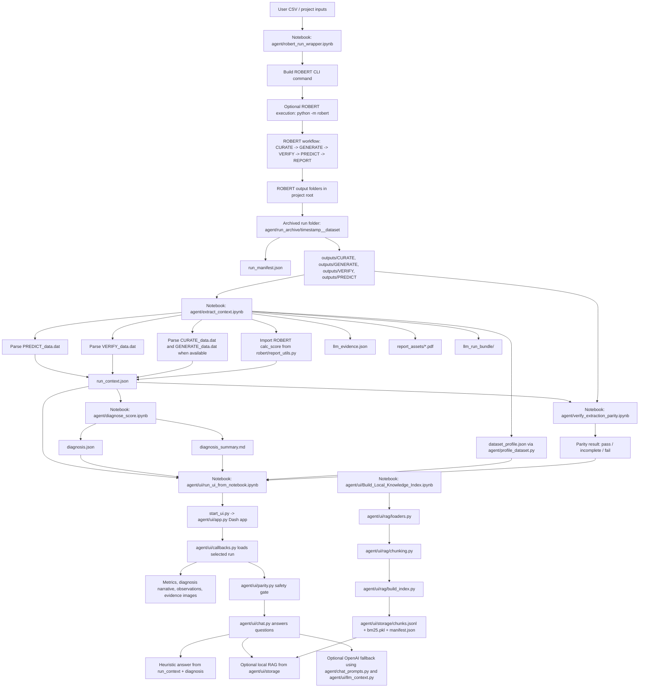

# Project Workflow Trace

Static inspection basis: this trace was built from the repository files, notebooks, and archived run artifacts present in this checkout. The notebooks were inspected as JSON; they were not executed during this documentation pass. Existing code and ROBERT source files were not modified.

## 1. Executive Summary

- This project is a companion layer around ROBERT. It does not replace ROBERT, change ROBERT model behavior, or create a competing score.
- A user first runs ROBERT through `agent/robert_run_wrapper.ipynb`, which can execute `python -m robert` and then archives ROBERT's fixed output folders into a timestamped run folder.
- `agent/extract_context.ipynb` reads archived ROBERT output files, mainly `PREDICT_data.dat` and `VERIFY_data.dat`, and writes structured evidence files such as `run_context.json`, `llm_evidence.json`, and an `llm_run_bundle/`.
- The ROBERT score itself is computed by ROBERT logic in `robert/report_utils.py` via `calc_score()`. The extractor imports that function to reconstruct score fields from `PREDICT` and `VERIFY` text outputs when both files are available.
- `agent/diagnose_score.ipynb` reads `run_context.json` and writes `diagnosis.json` plus `diagnosis_summary.md`. It organizes ROBERT evidence and adds deterministic interpretation observations; these are companion explanations, not ROBERT score components.
- The local Dash UI starts through `agent/ui/run_ui_from_notebook.ipynb` or `start_ui.py`. It loads run archives, displays metrics, observations, evidence images, and provides chat-style explanations.
- Chat behavior is evidence-gated by DAT-file parity checks against ROBERT source outputs. If parity fails, the UI disables chat for that run.
- Optional OpenAI and local knowledge-base retrieval paths exist, but the primary evidence remains extracted ROBERT output data.

## 2. End-to-End Workflow Diagram

## 3. Workflow Boundary

This companion workflow sits after or around ROBERT. The ROBERT stages remain ROBERT-owned:

| ROBERT stage | ROBERT output consumed by agent | Agent use |
|---|---|---|
| CURATE | `outputs/CURATE/CURATE_data.dat`, `outputs/CURATE/CURATE_options.csv`, curated CSVs | Dataset size, feature counts, curation warnings, dataset profile fallback |
| GENERATE | `outputs/GENERATE/GENERATE_data.dat`, heatmap images | Model-screening summary and displayable report assets |
| VERIFY | `outputs/VERIFY/VERIFY_data.dat`, `VERIFY_tests_*.png` | Verification outcomes, flawed-model counts, sorted CV arrays, parity checks |
| PREDICT | `outputs/PREDICT/PREDICT_data.dat`, prediction CSVs, result/SHAP/PFI/outlier/y-distribution images | Metrics, descriptors, outliers, feature importance, plots, score reconstruction inputs |
| REPORT | Root `ROBERT_report.pdf`, archived into `report_assets/` | User-viewable PDF/report asset; not the primary LLM evidence source |

The project documentation in `README_AGENT.md` states that the prototype reads ROBERT output folders, extracts evidence from the same underlying files that support the ROBERT report, and optionally uses an LLM to translate findings into plain language.

## 4. ROBERT Source Points Used By The Companion

### ROBERT score

- Function: `calc_score(dat_files, suffix, pred_type, data_score)` in `robert/report_utils.py`.
- Called by ROBERT report generation in `report.print_score()` in `robert/report.py`.
- Also imported by `agent/extract_context.ipynb` Cell 14/15 to reconstruct `score.no_pfi`, `score.pfi`, and component dictionaries from archived `PREDICT_data.dat` and `VERIFY_data.dat`.
- Helper functions in `robert/report_utils.py` used by `calc_score()` include `get_predict_scores()`, `get_verify_scores()`, `score_rmse_mcc()`, and `calc_penalty_r2()`.

Observed from static inspection:

- Regression ROBERT score sums CV performance, test performance, SD coverage, CV/test RMSE agreement, flawed-model contribution, and sorted-CV contribution.
- Classification ROBERT score uses CV/test MCC scoring, flawed-model contribution, sorted-CV contribution, CV/test MCC gap, and a descriptor score key if populated.
- The agent does not define a separate score. It imports ROBERT's `calc_score()` when reconstructing score fields.

### ROBERT PDF report

- Class: `report` in `robert/report.py`.
- PDF write function: `make_report(report_html, HTML)` in `robert/report_utils.py`, which writes `ROBERT_report.pdf` in the working directory.
- `report.__init__()` in `robert/report.py` assembles sections in this order: header, score, warnings, advanced score analysis, y distribution, features, outliers, model screening, reproducibility, transparency, abbreviations, predictions, miscellaneous.
- `report.get_repro()` in `robert/report.py` calls `repro_info()` in `robert/report_utils.py`, which reads module DAT files based on `report_modules`.

Not determined from static inspection: an exhaustive list of every image and file consumed by every PDF report subsection. The confirmed report source points include DAT files collected by `repro_info()`, direct reads from `PREDICT/PREDICT_data.dat` in multiple report methods, and generated plots referenced by report rendering.

## 5. Notebook Trace

### 5.1 `agent/robert_run_wrapper.ipynb`

Purpose: optionally run ROBERT and archive outputs before another run overwrites the fixed root-level folders.

Key notebook steps:

| Notebook cell purpose | What it does | Functions defined in this notebook |
|---|---|---|
| Cell 2 Guide: Choose Dataset and ROBERT Options | Resolves project root, dataset path, `ROBERT_OPTIONS`, and flags such as `RUN_ROBERT` and `COPY_INSTEAD_OF_MOVE`. | `resolve_project_root()`, `dedupe_paths_case_insensitive()`, `resolve_dataset_path()` in `agent/robert_run_wrapper.ipynb` |
| Cell 4 Guide: Preview Dataset Columns and Sample Rows | Reads a sample of the selected CSV with pandas and prints likely name, target, ignore, and descriptor columns. | No reusable project function; notebook code only |
| Cell 6 Guide: Helper Functions | Defines run-folder naming, CLI argument conversion, ROBERT command construction, subprocess execution, archiving, version/report discovery, and manifest writing. | `sanitize_name()`, `build_run_folder()`, `options_to_cli_args()`, `build_robert_command()`, `run_robert_if_requested()`, `archive_output_dirs()`, `detect_robert_version_from_archived_outputs()`, `find_report_pdfs()`, `write_manifest()` in `agent/robert_run_wrapper.ipynb` |
| Cell 7 Guide: Execute and Archive the Run | Builds display and execution commands, creates `agent/run_archive/<timestamp>__<dataset>/`, runs ROBERT when enabled, archives `CURATE`, `GENERATE`, `VERIFY`, `PREDICT`, and writes `run_manifest.json`. | Uses notebook-defined functions above |

Inputs and outputs:

- Input: dataset CSV resolved from `DATASET_RELATIVE`.
- Input: `ROBERT_OPTIONS`, converted into `--key value` command-line flags.
- Optional command: `python -m robert ... --csv_name <dataset>`.
- Output folder: `agent/run_archive/<timestamp>__<dataset>/`.
- Output file: `run_manifest.json`.
- Output subfolder: `outputs/` containing archived ROBERT module folders.

Relationship to ROBERT:

- The wrapper invokes ROBERT through the CLI only. It does not call or modify ROBERT internals.
- The root-level ROBERT workflow order is confirmed in `robert/robert.py`: CURATE, GENERATE, VERIFY, PREDICT, REPORT.

### 5.2 `agent/extract_context.ipynb`

Purpose: convert archived ROBERT outputs into structured, auditable evidence files.

Key notebook steps:

| Notebook cell purpose | What it does | Functions defined or used |
|---|---|---|
| Cell 2 Guide: Point to a Run Folder | Selects `RUN_FOLDER`, either explicitly or by newest folder in `agent/run_archive/`. | `resolve_project_root()` in `agent/extract_context.ipynb` |
| Cell 4 Guide: Check Which Output Files Are Present | Locates `PREDICT_data.dat`, `VERIFY_data.dat`, `CURATE_data.dat`, `GENERATE_data.dat`, reads `run_manifest.json`, discovers/copies report PDFs into `report_assets/`. | `read_dat()`, `dedupe_paths()`, `sanitize_tag()`, `discover_report_pdfs()` in `agent/extract_context.ipynb` |
| Cell 6 Guide: Parser Helper | Defines null-safe conversion helpers and splits DAT files into No PFI and PFI blocks. | `safe_float()`, `safe_int()`, `split_into_blocks()` in `agent/extract_context.ipynb` |
| Cell 8 Guide: Parse PREDICT_data.dat | Extracts model metadata, descriptors, train/test counts, regression/classification metrics, SD, y range, artifact paths, outliers, quartile counts, warnings, and feature-importance summary. | `parse_predict_block()` in `agent/extract_context.ipynb` |
| Cell 10 Guide: Parse VERIFY_data.dat | Extracts flawed-model baseline outcomes, passed/unclear/failed counts, `flawed_mod_score`, sorted CV arrays, and VERIFY warnings. | `parse_verify_block()` in `agent/extract_context.ipynb` |
| Cell 12 Guide: Parse CURATE_data.dat and run_manifest.json | Extracts initial/final datapoints, feature counts, feature removals, ignored descriptors, model-screening summaries, warnings, version, command, and dataset provenance. | `parse_curate_dat()`, `parse_generate_dat()`, `parse_robert_version_from_lines()`, `parse_command_from_lines()` in `agent/extract_context.ipynb` |
| Cell 14 Guide: Assemble and Write run_context.json | Imports ROBERT score logic, builds `run_context.json`, `llm_evidence.json`, `llm_run_bundle/`, copies report assets, and writes `bundle_index.json`. | `_score_components_from_data_score()` in `agent/extract_context.ipynb`; `calc_score()` from `robert/report_utils.py` |
| Cell 17 Guide: Build dataset_profile.json for the bot | Calls reusable dataset profiler and writes `dataset_profile.json`. | `profile_dataset()` from `agent/profile_dataset.py` |

Primary generated artifacts:

- `run_context.json`
- `llm_evidence.json`
- `llm_run_bundle/run_context.json`
- `llm_run_bundle/llm_evidence.json`
- `llm_run_bundle/bundle_index.json`
- `report_assets/<dataset>__<timestamp>__ROBERT_report.pdf`
- `dataset_profile.json`

Important source-policy detail:

- `llm_evidence.json` sets `source_of_truth` to `ROBERT outputs`.
- Its policy block says the PDF is for view only, the LLM must use extracted evidence only, and no competing score system should be used.
- `bundle_index.json` routes UI PDF viewing to `report_assets` and LLM prompt evidence to `llm_evidence.json`.

Not determined from static inspection: whether every possible ROBERT output text variant is handled by the notebook parser. The code is explicitly null-safe for missing files and unparseable values.

### 5.3 `agent/diagnose_score.ipynb`

Purpose: read `run_context.json` and create deterministic, explanation-ready diagnosis artifacts.

Key notebook steps:

| Notebook cell purpose | What it does | Functions defined |
|---|---|---|
| Cell 2 Guide: Select a Run Context | Selects `RUN_CONTEXT_PATH`, defaulting to newest `run_context.json` in `agent/run_archive/`. | `resolve_project_root()` in `agent/diagnose_score.ipynb` |
| Cell 4 Guide: Helper Functions | Normalizes ratio strings and VERIFY result lists, and appends structured observations. | `parse_ratio()`, `normalize_verify_results()`, `add_observation()` in `agent/diagnose_score.ipynb` |
| Cell 6 Guide: Build LLM-Ready Context From ROBERT Outputs | Builds a `diag` structure containing provenance, availability, ROBERT score fields, extracted evidence, observations, LLM policy, and derived convenience values. | Uses helper functions above |
| Cell 7b Guide: Interpretation Pass | Adds interpretation observations such as low train-to-descriptor ratio, weak-but-consistent model, CV/test gap, test better than CV, dominant feature, and ROBERT-reported correlation warnings. | `get_primary_metric()`, `all_verify_passed()` in `agent/diagnose_score.ipynb` |
| Cell 8 Guide: Write Output Artifacts | Writes `diagnosis.json` and `diagnosis_summary.md` next to `run_context.json`. | Uses notebook variables and helpers |

Important distinction:

- The notebook says no ROBERT score is recomputed in the diagnosis helper section.
- The interpretation pass defines local constants such as `THRESHOLD_MIN_N_PER_DESCRIPTOR`, `THRESHOLD_CV_TEST_GAP_WARNING`, and `THRESHOLD_DOMINANT_FEATURE`. These are companion interpretation thresholds, not ROBERT score thresholds.
- Derived values are labeled as convenience-only in `diagnosis.json`.

Outputs:

- `diagnosis.json`
- `diagnosis_summary.md`

### 5.4 `agent/ui/run_ui_from_notebook.ipynb`

Purpose: guide a notebook user through installing UI dependencies and starting the local Dash app.

Key notebook steps:

| Notebook cell purpose | What it does | Functions or modules used |
|---|---|---|
| Step 1: Configure Paths and Environment | Resolves project root, finds `start_ui.py` and `requirements_ui.txt`, imports UI config loaders, checks API key/model/response-style/chat-mode sources. | `load_api_key()`, `load_openai_model()`, `load_response_style()`, `load_chat_mode()` from `agent/ui/config.py` |
| Step 2: Install/Update UI Dependencies | Runs `pip install -r requirements_ui.txt` in the active notebook environment and verifies core imports if pip returns an error. | notebook subprocess code |
| Step 3: Optional API Key and Model | Documents environment variables and `agent/ui/config/.env` use. The notebook explicitly says not to paste a key into the notebook. | UI config loaders from `agent/ui/config.py` |
| Step 4: Stop Any Existing UI Server | Terminates an existing `ui_proc` from the notebook session if present. | notebook process handling |
| Step 5: Start the UI Server | Starts `start_ui.py` through `subprocess.Popen()` and prints `http://127.0.0.1:8050`. | `start_ui.py` |
| Step 6: Open the UI in Your Browser | Calls `webbrowser.open()` on the local URL. | Python standard library |

Runtime path:

- `start_ui.py` adds `agent/ui/` to `sys.path`, imports `main()` from `agent/ui/app.py`, and runs it.
- `agent/ui/app.py` initializes the Dash app, loads configuration, discovers run contexts, creates the layout, and starts the server.

### 5.5 `agent/verify_extraction_parity.ipynb`

Purpose: verify that extracted `run_context.json` values match source ROBERT DAT files.

Key notebook steps:

| Notebook cell purpose | What it does | Functions/classes defined |
|---|---|---|
| Cell 3: Define Parity Result Data Structure | Defines a serializable parity result object. | `ParityResult` dataclass in `agent/verify_extraction_parity.ipynb` |
| Cell 4: Helper Functions for Parsing | Defines safe number parsing and DAT block splitting. | `safe_float()`, `safe_int()`, `split_into_blocks()` in `agent/verify_extraction_parity.ipynb` |
| Cell 5: Extract PREDICT Evidence from Source Files | Extracts expected train/test counts, descriptor counts, regression metrics, and classification metrics from `PREDICT_data.dat`. | `extract_predict_parity()` in `agent/verify_extraction_parity.ipynb` |
| Cell 6: Extract VERIFY Evidence from Source Files | Extracts VERIFY test verdicts and sorted CV arrays from `VERIFY_data.dat`. | `extract_verify_parity()` in `agent/verify_extraction_parity.ipynb` |
| Cell 7: Compare Extracted Values Against Source | Compares source-derived expected values against `run_context.json`. | `check_predict_parity()`, `check_verify_parity()` in `agent/verify_extraction_parity.ipynb` |
| Cell 8: Main Parity Verification Function | Orchestrates load, extract, compare, and status assignment. | `check_parity()` in `agent/verify_extraction_parity.ipynb` |
| Future Extension: PDF Report Parity | Defines a placeholder only; PDF parsing is not implemented. | `parse_pdf_report_placeholder()` in `agent/verify_extraction_parity.ipynb` |

Parity status meanings are documented in the notebook:

- `pass`: critical evidence fields match source files.
- `incomplete`: run lacks some module files, but available evidence is correct.
- `fail`: extracted values do not match source.

The UI implements a runtime parity helper separately in `agent/ui/parity.py`.

### 5.6 `agent/ui/Build_Local_Knowledge_Index.ipynb`

Purpose: build a local-only keyword retrieval index from files in `agent/ui/knowledge/`.

Key notebook steps:

| Notebook cell purpose | What it does | Functions used |
|---|---|---|
| Privacy and Design | States that indexing and retrieval are local and OpenAI is not used for indexing or retrieval. | Markdown only |
| Configure paths | Resolves project root, creates `agent/ui/knowledge/` and `agent/ui/storage/` if needed. | `resolve_project_root()` in `agent/ui/Build_Local_Knowledge_Index.ipynb` |
| Add Documents | Scans for supported `.txt`, `.md`, and `.pdf` files. | `scan_knowledge_files()` from `agent/ui/rag/loaders.py` |
| Build the Local Index | Calls the reusable index builder. | `build_local_index()` from `agent/ui/rag/build_index.py` |
| Test Retrieval | Retrieves top chunks and formats a context preview. | `retrieve()`, `build_context()` from `agent/ui/rag/retrieve.py` |
| Evaluation settings cell | Rebuilds with multiple chunk sizes and tests several evaluation queries. | `build_local_index()` and `retrieve()` |

Generated artifacts:

- `agent/ui/storage/chunks.jsonl`
- `agent/ui/storage/bm25.pkl`
- `agent/ui/storage/manifest.json`

Notebook text says chat integration with local retrieval will be added later. Current static code in `agent/ui/chat.py` already imports `retrieve()` and `build_context()` and can include local RAG snippets in supported answer paths.

## 6. Script And Module Trace

### Run archive and extraction support

| File path | Function or class | Role in workflow |
|---|---|---|
| `agent/profile_dataset.py` | `profile_dataset()` | Reads archived CURATE files and original or curated CSV data, then writes `dataset_profile.json` when requested. |
| `agent/profile_dataset.py` | `_parse_curate_dat()` | Extracts datapoints, accepted descriptors, constant columns, non-numeric descriptors, correlated pairs, source CSV path, and warnings from `CURATE_data.dat`. |
| `agent/profile_dataset.py` | `_load_curate_options()` | Reads `CURATE_options.csv` for target, names, ignored columns, and CSV path. |
| `agent/profile_dataset.py` | `_find_curated_csv()` | Finds a curated CSV fallback in `outputs/CURATE/`. |
| `agent/profile_dataset.py` | `_pick_source_csv()` | Chooses original CSV when present, otherwise falls back to curated CSV and records warnings. |
| `agent/profile_dataset.py` | `_top_descriptor_target_correlations()` | Computes descriptor-target R2 values from the curated CSV when possible. |
| `agent/normalize_run_archives.py` | `normalize_runs()` | Standalone utility that rewrites report-asset metadata and rebuilds `llm_run_bundle/` from existing `run_context.json` and `llm_evidence.json`. |
| `agent/normalize_run_archives.py` | `rebuild_bundle()` | Recreates bundle files and `bundle_index.json`. |

### UI startup and configuration

| File path | Function or class | Role in workflow |
|---|---|---|
| `start_ui.py` | top-level script | Adds `agent/ui/` to import path and runs `main()` from `agent/ui/app.py`. |
| `agent/ui/app.py` | `initialize_app()` | Loads config, discovers run contexts, creates Dash app layout, and handles no-run layout. |
| `agent/ui/app.py` | `main()` | Starts Dash server on defaults from `agent/ui/config.py`. |
| `agent/ui/config.py` | `load_api_key()` | Loads `ROBERT_CHAT_API_KEY` from environment or `agent/ui/config/.env`; server-side only. |
| `agent/ui/config.py` | `load_openai_model()` | Loads `ROBERT_OPENAI_MODEL`, defaulting to `gpt-4o-mini`. |
| `agent/ui/config.py` | `load_response_style()` | Loads `REPORT_ONLY` or `REPORT_WITH_KB`. |
| `agent/ui/config.py` | `load_chat_mode()` | Loads `HEURISTICS_FIRST` or `LLM_ONLY`. |
| `agent/ui/config.py` | `get_run_archive_root()` | Resolves `agent/run_archive/`. |
| `agent/ui/config.py` | `get_config()` | Returns UI root, project root, archive root, API key, model, style, chat mode, and debug flag. |

### UI data loading and display

| File path | Function or class | Role in workflow |
|---|---|---|
| `agent/ui/utils.py` | `find_run_context_files()` | Finds `run_context.json` files in run archive folders, including fallback inside `llm_run_bundle/`. |
| `agent/ui/utils.py` | `load_run_context()` | Loads selected `run_context.json`. |
| `agent/ui/utils.py` | `load_diagnosis_summary()` | Loads `diagnosis_summary.md`. |
| `agent/ui/utils.py` | `load_diagnosis_json()` | Loads `diagnosis.json`. |
| `agent/ui/utils.py` | `load_dataset_profile()` | Loads `dataset_profile.json` if present. |
| `agent/ui/utils.py` | `build_metrics_rows()` | Builds the metrics table rows from `run_context.json` and optional `diagnosis.json`. |
| `agent/ui/utils.py` | `find_evidence_images()` | Collects image artifacts from run outputs and encodes them as data URIs for display. |
| `agent/ui/components.py` | `create_header()` | Builds title, run selector, refresh button, API status, local RAG toggle, response style, and chat mode controls. |
| `agent/ui/components.py` | `create_document_panel()` | Builds the left diagnostic viewer area. |
| `agent/ui/components.py` | `create_chat_panel()` | Builds the chat, guided questions, export controls, and status fields. |
| `agent/ui/components.py` | `create_main_layout()` | Builds full UI layout and Dash stores. |
| `agent/ui/components.py` | `empty_layout()` | Shows notebook order instructions when no diagnostic runs are found. |

### UI callbacks and safety gate

| File path | Function or class | Role in workflow |
|---|---|---|
| `agent/ui/callbacks.py` | `update_document_on_run_selection()` | Loads selected run context, injects dataset profile in memory, runs parity, loads diagnosis files, builds metrics, observations, narrative, and images. |
| `agent/ui/callbacks.py` | `sync_chat_guardrail()` | Enables chat for parity `pass` and `incomplete`; disables chat for parity `fail`. |
| `agent/ui/callbacks.py` | `handle_chat_message()` | Routes user and guided FAQ messages to `answer_question()` or `answer_guided_faq()`, blocks failed-parity runs, and stores chat history. |
| `agent/ui/callbacks.py` | `generate_report_summary()` | Optional OpenAI-backed whole-report summary from run context, dataset profile, diagnosis summary, and diagnosis JSON. |
| `agent/ui/callbacks.py` | `export_chat_history()` | Exports chat history; implementation is in the same file after the helper functions. |
| `agent/ui/parity.py` | `check_parity()` | Runtime parity check used by the UI against `outputs/PREDICT/PREDICT_data.dat` and `outputs/VERIFY/VERIFY_data.dat`. |
| `agent/ui/parity.py` | `_extract_predict_expected()` | Extracts expected PREDICT values from DAT source. |
| `agent/ui/parity.py` | `_extract_verify_expected()` | Extracts expected VERIFY values from DAT source. |

### Chat and explanation layer

| File path | Function or class | Role in workflow |
|---|---|---|
| `agent/ui/chat.py` | `answer_question()` | Main chat router. Uses heuristics first by default, local RAG where available, and optional OpenAI fallback when an API key is configured. |
| `agent/ui/chat.py` | `heuristic_answer()` | Deterministic answers for supported patterns such as VERIFY, descriptors, outliers, warnings, and plot-location questions. |
| `agent/ui/chat.py` | `heuristic_answer_from_diagnosis()` | Uses interpretation observations from `diagnosis.json`, especially for "why score" and CV/test gap questions. |
| `agent/ui/chat.py` | `answer_guided_faq()` | Uses guided FAQ requirements, run evidence, dataset profile, diagnosis, optional RAG, and OpenAI to answer preconfigured collaborator questions. |
| `agent/ui/chat.py` | `call_llm_api_with_budget()` | Packs evidence, formats prompt, calls OpenAI, and tracks estimated or returned token usage. |
| `agent/ui/chat.py` | `_select_evidence_artifacts()` | Selects relevant plot/image artifacts to attach to answers. |
| `agent/ui/llm_context.py` | `TokenBudget` | Tracks rough token and cost estimates. |
| `agent/ui/llm_context.py` | `pack_evidence()` | Converts `run_context.json` and `diagnosis.json` into compact evidence text for an LLM call. |
| `agent/chat_prompts.py` | `format_system_prompt()` | Selects `REPORT_ONLY` or `REPORT_WITH_KB` prompt templates. |
| `agent/ui/guided_faq.py` | `get_faq_item()` | Looks up a guided FAQ by ID. |
| `agent/ui/guided_faq.py` | `get_starter_items()` | Returns always-visible starter questions. |
| `agent/ui/guided_faq.py` | `get_category_options()` | Returns grouped guided-question dropdown options. |

### Local RAG modules

| File path | Function or class | Role in workflow |
|---|---|---|
| `agent/ui/rag/loaders.py` | `scan_knowledge_files()` | Recursively finds `.txt`, `.md`, and `.pdf` files. |
| `agent/ui/rag/loaders.py` | `extract_text()` | Extracts text from supported files; PDF extraction uses PyMuPDF through `_extract_pdf_text()`. |
| `agent/ui/rag/loaders.py` | `load_documents()` | Returns document records with text and SHA256 metadata. |
| `agent/ui/rag/chunking.py` | `chunk_text_words()` | Splits text into overlapping word chunks. |
| `agent/ui/rag/chunking.py` | `chunk_document()` | Builds chunk records with source metadata. |
| `agent/ui/rag/build_index.py` | `build_local_index()` | Builds a BM25 index with `rank_bm25`, writes `chunks.jsonl`, `bm25.pkl`, and `manifest.json`. |
| `agent/ui/rag/retrieve.py` | `retrieve()` | Loads the local BM25 index and returns top-k chunks. |
| `agent/ui/rag/retrieve.py` | `build_context()` | Formats retrieved chunks into an LLM-ready context block. |

## 7. Artifact Contract

| Artifact | Created by | Consumed by | Purpose |
|---|---|---|---|
| `agent/run_archive/<run>/outputs/` | `agent/robert_run_wrapper.ipynb` | Extractor, parity, UI image display | Archived ROBERT module outputs |
| `run_manifest.json` | `agent/robert_run_wrapper.ipynb` | `agent/extract_context.ipynb` | Reproducibility metadata: dataset, command, return code, ROBERT version, reports |
| `run_context.json` | `agent/extract_context.ipynb` | Diagnosis notebook, UI, parity checks, chat evidence packing | Main structured evidence record |
| `llm_evidence.json` | `agent/extract_context.ipynb` | `llm_run_bundle/`, intended prompt evidence | LLM-facing evidence payload with policy |
| `report_assets/*.pdf` | `agent/extract_context.ipynb` or `agent/normalize_run_archives.py` | UI and bundle | Archived ROBERT report PDF for display |
| `llm_run_bundle/` | `agent/extract_context.ipynb` or `agent/normalize_run_archives.py` | UI or downstream LLM workflows | Portable bundle of evidence JSON plus report assets |
| `bundle_index.json` | `agent/extract_context.ipynb` or `agent/normalize_run_archives.py` | Downstream routing | Declares which files are for UI PDF view and which are LLM evidence |
| `dataset_profile.json` | `profile_dataset()` in `agent/profile_dataset.py`, called by `agent/extract_context.ipynb` | UI callbacks, chat evidence packer | Compact dataset inventory and curation context |
| `diagnosis.json` | `agent/diagnose_score.ipynb` | UI, chat heuristics, export | Machine-readable observations and derived convenience values |
| `diagnosis_summary.md` | `agent/diagnose_score.ipynb` | UI document panel, report summary payload | Human-readable diagnosis narrative |
| `agent/ui/storage/chunks.jsonl` | `agent/ui/Build_Local_Knowledge_Index.ipynb` via `build_local_index()` | `retrieve()` | Local knowledge chunks |
| `agent/ui/storage/bm25.pkl` | `agent/ui/Build_Local_Knowledge_Index.ipynb` via `build_local_index()` | `retrieve()` | Local BM25 retrieval model |
| `agent/ui/storage/manifest.json` | `agent/ui/Build_Local_Knowledge_Index.ipynb` via `build_local_index()` | human audit and stale-index hints | Local index metadata |

## 8. Stable Parse Targets

Stable enough to parse, based on code and tests:

- `outputs/PREDICT/PREDICT_data.dat`: score-critical metrics, descriptors, train/test counts, artifact paths, outliers, feature-importance summaries.
- `outputs/VERIFY/VERIFY_data.dat`: VERIFY baseline outcomes, failed/unclear/passed counts, sorted CV arrays, flawed-model score contribution.
- `outputs/CURATE/CURATE_data.dat`: dataset/feature counts, constant columns, non-numeric descriptors, high-correlation removals, warnings.
- `outputs/CURATE/CURATE_options.csv`: target, names, ignored columns, CSV path for dataset profiling.
- `outputs/GENERATE/GENERATE_data.dat`: model-screening summary entries and warnings when matching parser patterns.
- `run_manifest.json`: command, dataset path, archived module list, report PDF list, ROBERT version when detected.

Validation evidence:

- `tests/test_agent_parity.py` checks regression and classification `run_context.json` values against `PREDICT_data.dat` and `VERIFY_data.dat`.
- The same test file checks an incomplete run where `VERIFY`, `CURATE`, and `GENERATE` are unavailable and verifies null-safe behavior.
- `agent/verify_extraction_parity.ipynb` documents DAT-file parity as the UI ground-truth safeguard.

Not determined from static inspection: stability of every possible ROBERT text line across older or future ROBERT versions.

## 9. UI Explanation Flow

When a run is selected in the Dash UI:

1. `update_document_on_run_selection()` in `agent/ui/callbacks.py` loads `run_context.json`.
2. It resolves the run root with `get_run_root_from_context_path()` in `agent/ui/utils.py`.
3. It loads `dataset_profile.json` if present and attaches it to the in-memory `run_context`.
4. It runs `check_parity()` from `agent/ui/parity.py`.
5. It loads `diagnosis_summary.md` and `diagnosis.json`.
6. It builds a metrics table through `build_metrics_rows()` in `agent/ui/utils.py`.
7. It finds image evidence with `find_evidence_images()` in `agent/ui/utils.py`.
8. It renders metrics, evidence-linked observations, diagnosis narrative, and images in the document panel.
9. `sync_chat_guardrail()` enables or disables chat based on parity status.
10. `handle_chat_message()` routes typed questions or guided FAQ prompts into the chat layer.

Chat routing:

- Default mode is `HEURISTICS_FIRST`, loaded by `load_chat_mode()` in `agent/ui/config.py`.
- For supported topics, `heuristic_answer()` or `heuristic_answer_from_diagnosis()` in `agent/ui/chat.py` returns deterministic text from run evidence.
- For score questions, local RAG snippets may be added if the local index exists and local RAG is enabled.
- If no heuristic answer is available and an API key exists, `call_llm_api_with_budget()` can call OpenAI using packed evidence.
- If no heuristic answer is available and no API key exists, the UI returns a controlled no-key fallback.
- If parity status is `fail`, `handle_chat_message()` blocks the chat response and tells the user extraction verification failed.

## 10. Optional LLM And Knowledge Base Behavior

OpenAI configuration:

- `agent/ui/config.py` loads `ROBERT_CHAT_API_KEY` from the environment first, then `agent/ui/config/.env`.
- `agent/ui/.env.example` documents `ROBERT_OPENAI_MODEL`, `ROBERT_RESPONSE_STYLE`, and `ROBERT_CHAT_MODE`.
- `requirements_ui.txt` includes `openai>=1.0.0` and `python-dotenv>=1.0.0`.

Prompt constraints:

- `agent/chat_prompts.py` instructs the assistant to use only supplied run evidence and retrieved local context, not invent metrics, warnings, descriptor meanings, thresholds, or model behavior.
- `format_system_prompt()` in `agent/chat_prompts.py` chooses between `REPORT_ONLY` and `REPORT_WITH_KB`.
- `pack_evidence()` in `agent/ui/llm_context.py` compresses dataset, prediction type, model, ROBERT score, dataset profile, metrics, descriptor counts, VERIFY status, and key warnings.

Local knowledge base:

- `Build_Local_Knowledge_Index.ipynb` builds the index locally from `agent/ui/knowledge/`.
- `agent/ui/rag/retrieve.py` retrieves local chunks from `agent/ui/storage/`.
- The local RAG layer is reference/background support. It does not replace run-specific ROBERT evidence.

## 11. Additional Notebooks Discovered

| Notebook | Relationship to this companion workflow |
|---|---|
| `Examples/CSV_workflow/ROBERT_full_workflow.ipynb` | ROBERT example notebook. It defines a command line for `python -m robert --y Target_values --csv_name Robert_example.csv --csv_test Robert_example_test.csv --names Name`. It is part of ROBERT examples, not the companion agent workflow inspected above. |

No other `.ipynb` files were found by static file listing.

## 12. Open Questions And Static-Inspection Limits

- Not determined from static inspection: whether all notebook output cells reflect the current latest execution state after the existing uncommitted notebook modifications.
- Not determined from static inspection: whether every ROBERT version emits identical `PREDICT_data.dat`, `VERIFY_data.dat`, `CURATE_data.dat`, and `GENERATE_data.dat` text patterns.
- Not determined from static inspection: full PDF parsing parity, because `parse_pdf_report_placeholder()` intentionally raises `NotImplementedError`.
- Inferred: the intended presentation flow is wrapper -> extractor -> diagnosis -> parity/UI -> chat/explanation, because that order is stated in notebook usage notes, UI empty-layout instructions, and `PROGRESS.md`.
- Inferred: `agent/normalize_run_archives.py` is a maintenance utility rather than a required notebook workflow step, because no requested notebook calls it and its `main()` function is standalone.
- Inferred: local RAG is optional explanatory background, because the index notebook states indexing/retrieval are local and `agent/ui/chat.py` only appends retrieved context in specific answer paths or OpenAI fallback paths.

